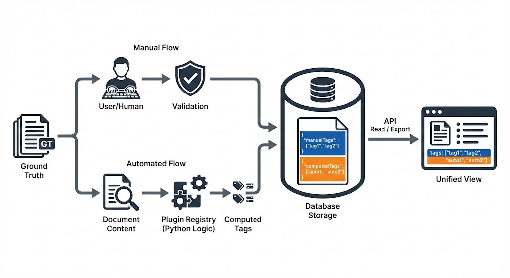
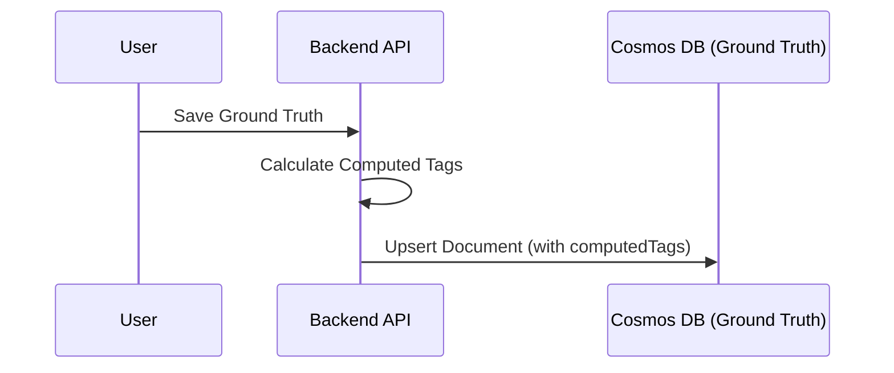

# Computed Tags Design for Ground Truth Curator



## 1. Design Goals

* **Separation of Concerns:** Manual tags remain the source-of-truth in the `manualTags` field, while computed tags live in a separate `computedTags` field within the same document.
* **Automation:** Computed tags are always recomputed when a ground truth is saved.
* **Unified View:** Exports and API reads present a union of `manualTags` ∪ `computedTags`.
* **Flexibility:** Easy to rebuild all computed tags if rules change (requires re-saving or a migration script).
* **Legacy Support:** Safe migration path for existing tags mixed in the manual field.

## 2. Data Model

### 2.1 Ground Truth Container (`ground_truth`)

We introduce explicit `manualTags` and `computedTags` fields to separate user intent from system generation. The legacy `tags` field is removed from storage and constructed dynamically on read/export.

```json
{
  "id": "gt_123",
  "datasetName": "dataset_1",      // Part of MultiHash PK
  "bucket": "uuid-string",         // Part of MultiHash PK
  "manualTags": ["foo", "bar"],    // Authoritative manual tags
  "computedTags": ["long_doc"],    // System generated tags
  // "tags": [...]                 // REMOVED: Constructed dynamically
  ...
}
```

**Note on History Item Tags:** History items (multi-turn conversation turns) do **not** have their own `tags` field. Tags are managed exclusively at the `GroundTruthItem` level via `manualTags` and `computedTags`. The v1-to-v2 migration removes any legacy `tags` field from history items.

### 2.2 Computed Tag Plugin Architecture

To ensure extensibility and maintainability, computed tags are defined via a plugin architecture. This allows developers to easily add new derivation rules without modifying the core logic.

**Base Plugin Interface:**

Each computed tag logic is encapsulated in a class inheriting from a base `ComputedTagPlugin`. The `compute()` method returns the tag string if applicable, or `None` if not. This unified interface supports both **static tags** (fixed `tag_key`) and **dynamic tags** (computed based on document content).

```python
from abc import ABC, abstractmethod
from app.domain.models import GroundTruthItem

class ComputedTagPlugin(ABC):
    @property
    @abstractmethod
    def tag_key(self) -> str:
        """The unique tag key for this computed tag (e.g., 'length:long').

        Must follow the group:value format.
        For dynamic plugins, use a placeholder like 'group:_dynamic'.
        """
        pass

    @abstractmethod
    def compute(self, doc: GroundTruthItem) -> str | None:
        """Compute the tag for this document.

        Args:
            doc: The GroundTruthItem to evaluate.

        Returns:
            The tag string if applicable, None otherwise.
            For static plugins, return self.tag_key or None.
            For dynamic plugins, return the computed tag string or None.
        """
        pass
```

**Plugin Registry:**

A registry collects all active plugins and prevents duplicate `tag_key` registrations. When `compute_all(doc)` is called, the registry iterates through all plugins and collects non-None results.

```python
class TagPluginRegistry:
    def __init__(self):
        self._plugins: List[ComputedTagPlugin] = []
        self._registered_keys: Set[str] = set()

    def register(self, plugin: ComputedTagPlugin):
        if plugin.tag_key in self._registered_keys:
            raise ValueError(f"Duplicate tag key '{plugin.tag_key}'")
        self._registered_keys.add(plugin.tag_key)
        self._plugins.append(plugin)

    def compute_all(self, doc: GroundTruthItem) -> List[str]:
        tags: List[str] = []
        for plugin in self._plugins:
            tag = plugin.compute(doc)
            if tag:
                tags.append(tag)
        return tags
    
    def get_all_keys(self) -> Set[str]:
        return {p.tag_key for p in self._plugins}
```

**Example: Static Tag Plugin**

For tags with a fixed value (e.g., `length:long`), return `self.tag_key` when the condition is met:

```python
class LongDocPlugin(ComputedTagPlugin):
    @property
    def tag_key(self) -> str:
        return "length:long"

    def compute(self, doc: GroundTruthItem) -> str | None:
        content = doc.answer or ""
        return self.tag_key if len(content) > 10000 else None
```

**Example: Dynamic Tag Plugin**

For tags where the value is computed from document content (e.g., `dataset:{datasetName}`), return the dynamically constructed tag string:

```python
class DatasetPlugin(ComputedTagPlugin):
    @property
    def tag_key(self) -> str:
        return "dataset:_dynamic"  # Placeholder for registration

    def compute(self, doc: GroundTruthItem) -> str | None:
        return f"dataset:{doc.datasetName}" if doc.datasetName else None
```

This registry replaces the static `DERIVED_TAG_KEYS` set. The set of keys is now dynamically generated from the registered plugins (`registry.get_all_keys()`). Note that for dynamic plugins, the registered key is a placeholder (e.g., `dataset:_dynamic`) while actual computed tags vary per document.

### 2.3 Manual Tag & Validator Architecture

To make manual tag definitions and validation rules configurable and extensible, we use a Provider pattern.

**Manual Tag Provider:**

Defines the *source* of allowed manual tags. This allows switching between simple environment-variable based configuration and more complex database-backed sources.

*Interface:*
```python
class ManualTagProvider(ABC):
    @abstractmethod
    def get_allowed_tags(self) -> Set[str]:
        """Returns a set of tags that users can manually apply."""
        pass
```

*Default Implementation (Env Var):*

A simple provider that reads a comma-separated list from `ALLOWED_MANUAL_TAGS`.

```python
class EnvVarManualTagProvider(ManualTagProvider):
    def get_allowed_tags(self) -> Set[str]:
        return set(os.getenv("ALLOWED_MANUAL_TAGS", "").split(","))
```

**Tag Validator:**

Validates the state of tags on a document (e.g., mutual exclusivity, required tags). Since validation requires logic, these remain class-based plugins.

```python
class TagValidator(ABC):
    @abstractmethod
    def validate(self, manual_tags: List[str], computed_tags: List[str]) -> List[str]:
        """Returns a list of error messages if validation fails."""
        pass
```

**Configuration:**
The active `ManualTagProvider` (e.g., `EnvVarManualTagProvider`) and list of `TagValidator`s are configured via environment variables or a configuration file.

## 3. Recomputation Strategy

### Selected Approach: Inline (Synchronous)

The API computes and writes to the `ground_truth` container synchronously. This is the simplest approach and ensures that the `computedTags` field is always consistent with the `manualTags` and other fields upon save.

**Architecture:**

1. **Receive:** API receives the ground truth update request.
2. **Compute:** API calculates the `computedTags` based on the document content and `manualTags`.
3. **Write:** API upserts the document with both `manualTags` and `computedTags` populated.

**Why this approach?**

* **Simplicity:** No extra infrastructure (Azure Functions, Sidecars) required.
* **Consistency:** The document is always in a valid state after the write completes.
* **Latency:** The computation overhead is negligible for the current set of rules.



## 4. API & Data Flow

### 4.1 Reading & Exporting

When reading or exporting, the `tags` field is constructed dynamically by merging `manualTags` and `computedTags`.

**Logic:**

1. Read `ground_truth` doc.
2. **Merge:** `tags = unique(manualTags + computedTags)`.

**Read DTO:**

```json
{
  "id": "gt_123",
  "datasetName": "dataset_1",
  "bucket": "uuid-string",
  "manualTags": ["foo"],                    // From DB
  "computedTags": ["has_image", "long_doc"], // From DB
  "tags": ["foo", "has_image", "long_doc"]  // Constructed on read
}
```

### 4.2 Saving (Write Path)

The save operation ensures `computedTags` are updated and no computed tags are stored as manual tags.

**Logic:**

1. Receive DTO with `manualTags`.
2. **Filter:** Strip any tag in `manualTags` that exists in `DERIVED_TAG_KEYS`.
3. **Derive:** Run derivation logic to generate `computedTags`.
4. **Persist:** Save `ground_truth` doc with the cleaned `manualTags` and new `computedTags`.

### 4.3 Bulk Recomputation Endpoint

To support scenarios where tag logic changes (e.g., a new plugin is added or an existing rule is modified), we expose an endpoint to trigger recomputation for all ground truth documents.

**Endpoint:** `POST /api/ground-truths/recompute-tags`

**Logic:**

1. **Iterate:** Query all ground truth documents (optionally filtered by dataset).
2. **For each document:**
   a. **Derive:** Run the current set of plugins to generate the new `computedTags` list.
   b. **Compare:** Check if the new `computedTags` differ from the stored `computedTags`.
   c. **Update:** If different, upsert the document with the new `computedTags`.
3. **Response:** Return a summary of processed and updated documents.

*Note: For large datasets, this operation should be asynchronous or batched to avoid timeouts.*

### 4.4 Export Pipeline Architecture

#### 4.4.1 Baseline contract

The export pipeline design must preserve the existing snapshot behaviors that other components rely on.

Stable behaviors:

* `POST /v1/ground-truths/snapshot` writes per-item JSON artifacts plus `manifest.json` under `exports/snapshots/{ts}/`.
* `GET /v1/ground-truths/snapshot` returns a downloadable JSON attachment and sets `Content-Disposition` with a filename.
* The frontend derives the download filename from the `Content-Disposition` header and expects the snapshot payload keys to remain stable.

Flexible behaviors:

* The internal implementation may shift to a processor and formatter pipeline.
* New export routes may introduce additional formats and delivery targets, as long as the snapshot endpoints above remain unchanged.

#### 4.4.2 v1 export pipeline API surface

We reuse the existing snapshot export route for pipeline-based exports, because it is rarely used and already aligned with export semantics. Snapshot routes stay intact for backward compatibility, with `POST /v1/ground-truths/snapshot` becoming the pipeline entry point.

Proposed route:

* `POST /v1/ground-truths/snapshot`

Request body shape:

```json
{
    "format": "json_snapshot_payload",
    "filters": {
        "datasetNames": ["dataset_a"],
        "status": "approved"
    },
    "processors": ["merge_tags"],
    "delivery": {
        "mode": "attachment"
    }
}
```

v1 defaults and constraints:

* Supported formats: `json_snapshot_payload` and `json_items`.
* Supported filters: `datasetNames` and `status`, with `status` defaulting to `approved`.
* Processor order defaults to configured environment settings if `processors` is omitted.
* `delivery.mode` defaults to `attachment` and preserves `Content-Disposition` behavior for downloaded JSON.

Implementation notes:

* Keep the existing snapshot endpoints and payload shape intact.
* Update the snapshot service implementation to route through the pipeline while preserving behavior.

To support custom transformations and various output formats, we use a pipeline architecture allowing for chained processing steps.

**1. Export Processors (Intermediate Steps):**

Plugins that transform the list of documents. These can be chained to perform sequential operations. Since the input and output are both lists, processors can modify fields (e.g., adding tags), filter documents, or change the number of documents (e.g., splitting one multi-turn conversation into multiple single-turn records).

```python
class ExportProcessor(ABC):
    @property
    @abstractmethod
    def name(self) -> str: pass

    @abstractmethod
    def process(self, docs: List[Dict[str, Any]]) -> List[Dict[str, Any]]:
        """Transforms the documents. Can modify fields, filter items, or split/explode documents (1-to-N)."""
        pass
```

**2. Export Formatters (Final Step):**

Plugins that convert the processed documents into the final output format.

```python
class ExportFormatter(ABC):
    @property
    @abstractmethod
    def format_name(self) -> str: pass

    @abstractmethod
    def format(self, docs: List[Dict[str, Any]]) -> Any:
        """Converts docs to string/bytes (e.g., CSV, JSON)."""
        pass
```

**3. Pipeline Configuration:**

* **Order of Operations:** The sequence of processors is configured via an environment variable (e.g., `EXPORT_PROCESSOR_ORDER="merge_tags,anonymize"`).
* **Formatter Selection:** The formatter is selected by the request (e.g., `?format=csv`).

#### 4.4.3 Processor and formatter interface rules

Interfaces follow the list-in/list-out pipeline design and must remain deterministic for tests.

Processor contract:

* `process()` accepts a list of export records and returns a list of export records.
* `name` must be lowercase, stable, and unique within the registry (e.g., `merge_tags`).
* Processors raise a validation error for invalid inputs rather than collecting errors inline.

Formatter contract:

* `format()` accepts a list of export records and returns `bytes` or `str`.
* `format_name` must be lowercase, stable, and unique (e.g., `json_items`).
* Formatters raise a validation error for unsupported output options.

Determinism guidance:

* Avoid non-deterministic timestamps in unit tests by allowing `snapshotAt` overrides or injecting a clock.
* Keep output payload keys stable and compare JSON payloads by parsing into objects.

#### 4.4.4 Registry and configuration strategy

We introduce registries to manage pipeline components and configure them via environment variables.

Registries:

* `ExportProcessorRegistry` registers processors by `name` and rejects duplicates.
* `ExportFormatterRegistry` registers formatters by `format_name` and resolves the requested format.
* Registries raise a clear validation error when a requested name is missing and the API returns `400` with the message.

Configuration:

* `GTC_EXPORT_PROCESSOR_ORDER` defines the default ordered processor list, comma-separated.
* If `GTC_EXPORT_PROCESSOR_ORDER` is unset or empty, no processors run by default.
* Request bodies may override processor order; unknown processor names return `400`.
* Format resolution is request-driven via the `format` field; unknown format names return `400`.

Container wiring:

* Registries are created in `backend/app/container.py` and passed into the snapshot pipeline service so routers remain thin.
* The snapshot route calls the service with resolved processor order and formatter name.

#### 4.4.5 Execution flow and delivery

Execution flow for `POST /v1/ground-truths/snapshot` when running the pipeline:

1. Load items from `GroundTruthRepo` using the selected filters, with `status` defaulting to `approved`.
2. Convert each item into an export record via `model_dump(mode="json", by_alias=True, exclude_none=True)`.
3. Apply the configured processor chain in order.
4. Format the output using the requested formatter.
5. Deliver the output using one of the following modes:
     * `attachment` for in-memory JSON via `JSONResponse`.
     * `artifact` for a generated file response via `FileResponse`.
     * `stream` for large payloads via `StreamingResponse`.

Content-Disposition handling:

* The delivery step sets `Content-Disposition` when returning a downloadable file or JSON attachment.
* The filename is generated in the delivery step so processors and formatters remain pure.

#### 4.4.6 Initial processors and formatters

Processor: `merge_tags`

* Adds a derived `tags` field that is the unique union of `manualTags` and `computedTags`.
* Keeps `manualTags` and `computedTags` in the record for downstream auditing.

Formatter: `json_snapshot_payload`

* Preserves the existing `GET /v1/ground-truths/snapshot` response shape.
* Output shape:

```json
{
    "schemaVersion": "v2",
    "snapshotAt": "20260116T000000Z",
    "datasetNames": ["dataset_a"],
    "count": 2,
    "filters": {
        "status": "approved",
        "datasetNames": ["dataset_a"]
    },
    "items": [
        {
            "id": "gt_1",
            "datasetName": "dataset_a",
            "manualTags": ["tag:a"],
            "computedTags": ["tag:b"],
            "tags": ["tag:a", "tag:b"]
        }
    ]
}
```

Formatter: `json_items`

* Returns only the list of export records.
* Output shape:

```json
[
    {
        "id": "gt_1",
        "datasetName": "dataset_a",
        "manualTags": ["tag:a"],
        "computedTags": ["tag:b"],
        "tags": ["tag:a", "tag:b"]
    }
]
```

Schema versioning and manifests:

* `schemaVersion` remains `v2` for JSON payloads to preserve existing snapshot compatibility.
* When the delivery mode writes per-item artifacts, the export pipeline writes a `manifest.json` alongside items with `schemaVersion`, `snapshotAt`, `datasetNames`, `count`, and `filters`.

#### 4.4.7 Export storage interface (multi-backend)

We generalize the existing snapshot storage abstraction into an export storage interface to support multiple backends, starting with Azure Blob Storage.

Design goals:

* Keep a stable interface that supports both local filesystem and Blob storage.
* Allow snapshot and pipeline exports to write artifacts without coupling to a specific backend.
* Use a consistent artifact key layout: `exports/snapshots/{timestamp}/{filename}`.

Proposed interface (minimum required methods):

* `write_json(key: str, obj: dict) -> None` for manifest and JSON payloads.
* `write_bytes(key: str, data: bytes, content_type: str) -> None` for formatted outputs.
* `open_read(key: str) -> BinaryIO` for streaming reads.
* `list_prefix(prefix: str) -> list[str]` for artifact discovery when needed.

Local filesystem remains the default dev/test implementation, while Blob becomes the first cloud target.

#### 4.4.8 Azure Blob configuration and authentication

Add explicit settings to `backend/app/core/config.py` because `extra="forbid"` rejects unknown env vars.

Required settings:

* `GTC_EXPORT_STORAGE_BACKEND` with values `local` or `blob`.
* `GTC_EXPORT_BLOB_ACCOUNT_URL` for the storage account endpoint.
* `GTC_EXPORT_BLOB_CONTAINER` for the target container name.

Authentication:

* Use `DefaultAzureCredential` from `azure-identity` for all environments.
* Production should rely on managed identity for Blob access.
* Local execution uses the same credential chain and should authenticate through your developer identity.

Local execution warning:

* When using the Blob backend locally, exports write your local data into the configured Blob container.
* Ensure the account and container are scoped for development and review access policies before running exports.

Dependency updates:

* Add `azure-storage-blob` to `backend/pyproject.toml` to enable Blob operations.

#### 4.4.9 Delivery strategy for Blob-hosted artifacts

We select backend streaming as the initial delivery strategy to preserve the existing download behavior.

Decision:

* The API streams from Blob and returns a `StreamingResponse` or `FileResponse` with `Content-Disposition` set by the backend.

Rationale:

* Preserves the current filename parsing behavior in the frontend.
* Avoids exposing container access or SAS URLs to clients in the initial milestone.

Security expectations:

* Backend access to Blob uses managed identity or connection string credentials.
* Responses remain authenticated through the existing API surface; no public Blob access required.

#### 4.4.10 Test strategy and rollout

Test coverage targets for the export pipeline:

* Registry duplicate name protections for processors and formatters.
* Processor order configuration parsing via `GTC_EXPORT_PROCESSOR_ORDER`.
* JSON output shape compatibility with existing snapshot download tests.
* Delivery mode selection for large payloads, exercised via a small fake dataset and a streaming response path.

Suggested test locations:

* `backend/tests/unit/test_export_registry.py` for registry and config parsing behavior.
* `backend/tests/unit/test_export_pipeline.py` for processor order and formatter outputs.
* `backend/tests/integration/ground_truths/test_snapshot_download_endpoint.py` for snapshot payload compatibility.

Determinism guidance:

* Inject a fixed `snapshotAt` value or a clock in tests to avoid timestamp drift.
* Compare JSON outputs via parsed objects instead of raw string equality.

Rollout notes:

* Keep existing snapshot endpoints and payload keys unchanged.
* Introduce pipeline internals behind the same routes to avoid breaking clients.

**Execution Flow:**
`DB Docs -> [Processor 1] -> [Processor 2] -> ... -> [Formatter] -> Output`

## 5. Migration Plan

### 5.1 Schema Update

1. Add `manualTags` and `computedTags` to the `ground_truth` schema (conceptually, as it's NoSQL).
2. Update API to read/write using the new logic.

### 5.2 Data Migration

To clean up existing data where computed tags might be mixed into the manual list and populate the new field:

**Migration Job Logic:**

For each ground truth document:

1. Read GT doc.
2. **Initialize:** If `manualTags` does not exist, initialize it from the existing `tags` field.
3. **Derive:** Calculate `computedTags` based on current rules (using the Plugin Registry).
4. **Filter:** Identify tags in `manualTags` that are present in `computedTags` (or registered as computed) and remove them from `manualTags`.
5. **Update:** Set `manualTags` = cleaned tags, `computedTags` = derived tags.
6. **Cleanup:** Remove the `tags` field.
7. Upsert the updated GT doc.

This ensures `manualTags` eventually contains *only* truly manual tags and the legacy `tags` field is removed.

### 5.3 Configuration Cleanup

We must ensure that tags defined in `ComputedTagPlugin`s are **not** included in the `ManualTagProvider`'s allowed list.

* **Action:** Review the `ManualTagProvider` implementation (or configuration) and remove any tags that are now computed (e.g., `long_doc`, `has_image`).
* **Validation:** The application startup should verify that `ManualTagProvider.get_allowed_tags()` and `TagPluginRegistry.get_all_keys()` are disjoint sets.
* **Database:** Delete the corresponding tag documents from the `tags` container in Cosmos DB (if used by the legacy provider).
* **Result:** These tags will disappear from the UI's tag picker, preventing users from manually applying them.

## 6. UX Considerations

* **Validation:** Backend rejects writes to `computedTags` and optionally warns if `manualTags` contains computed keys.
* **Display:**
  * **Manual Tags:** Editable pill group.
  * **Auto Tags:** Read-only chips (e.g., different color, tooltip "Automatically assigned").

## TODOs

* ~~add dataset as a computed tag~~ *(addressed via dynamic tag plugin pattern)*
* document the derivation rules for initial computed tags
* aligning on the simple approach where computed tags are always recomputed on save by the API
