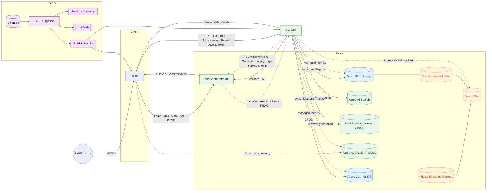

# Ground Truth Curation — MVP Requirements

## 1 Personas

- SME Reviewer: reviews assigned items, approves/rejects/edits, applies tags.
- Curator Lead: assigns batches, monitors progress, exports snapshots.

## 2 Goals and success criteria

- SMEs can review assigned items quickly and reliably.
- Weekly snapshot/export available within 10 minutes of cutoff.

### KPIs

- Number of ground truths each sme creates/reviews per week.
- 90% of assigned items reviewed within 5 business days.
- 100% of mutations recorded with user, time.
- todo: collect time per GT review

## 3 Scope (MVP) and Non-goals

In scope (MVP)

- Retrieve generated ground truths assigned to the SME from Cosmos.
- Single reviewer per item; no concurrent editing.
- Decisions: Approve, Delete, Edit content/fields.
- Tagging: apply from controlled vocabulary.
- Soft delete low-quality items (restorable by Admin).
- Batch assignment per SME; dashboard with status.
- Weekly snapshot + export to blob storage (JSON schema v1).

Out of scope (MVP)

- Multi-reviewer workflows/consensus.
- Notifications/reminders.
- Analytics beyond basic KPIs.
- Product versions attached to GT are out of scope for MVE (not tied to a specific product/version).

## 4 Primary flow (happy path)

1. Curator Lead imports generated ground truths into Cosmos.
2. Curator Lead applies sampling, and splits that sample amongst the SMEs.
3. SME opens Batch, reviews items, applies tags, and approves/deletes/edits.
4. SME self-serves new samples of ground truths for curation.
5. On weekly cutoff, a Snapshot captures item states; Curator Lead exports JSON (array) for evals.

### 4.1 Mini architecture


## 5 Detailed requirements with acceptance criteria

### Review UI

- Must: SME sees only their assigned Batches and Items.
- Accept:
  - Given an SME assigned Batch B, when they open Review, then only items from B are listed and other batches are inaccessible.

### Import New GT
- Must: allow curator to bulk import synthetic GT
- Must: allow for negative cases to be added the same way via the API by Curator

### Approve/Reject/Edit

- Must: SME can Approve, Delete, or Edit and save.
- Accept:
  - When SME edits and saves, the original synthetic question is preserved and the edited one is saved separately.
- Must: SME can generate an answer using an LLM from the current question and relevant context.
- Accept:
  - When SME generates an answer, then it is based on the latest Version and any attached documents and relevant paragraphs.
- Must: After SME approves, it cannot be edited further with admin override. It should immediately be removed from their queue.
- Must: After SME approves, cannot be deleted by SME. Could be deleted by Curator/Admin.

### Integration with Retrieval System

- Must: UI connects to AI Search so that SMEs can find and attach relevant documents easily
- Accept:
  - Given a document is relevant, when SME attaches it, then it appears in item metadata and in exports.
  - When SME detaches a document, then it is removed from item metadata and exports.
  - When a document is relevant, it requires a relevant paragraph to be attached.
  - The AI Search index must be updated sprintly to the latest baseline for the best results.

### Tagging

- Must: Apply multiple tags from a controlled list; Admin can manage tags.
- Accept:
  - Given Tag T exists, when SME applies T, then T appears in item metadata and in exports.

### Delete (soft) and restore

- Must: Allow soft delete; Admin or SME can restore.
- Accept:
  - When item is soft-deleted, it’s hidden from default views/exports but retained in history; restoring makes it visible again.
- Must: Allow for periodic cleanup of soft-deleted items.
- Accept:
  - Given a soft-deleted item, when Admin initiates cleanup, then it is permanently removed from the system.

### Batch assignment

- Must: Items grouped as Batches; each Batch has a single assignee.
- Accept:
  - SME cannot access Batches not assigned to them without Admin override.

### Stats

- Must: SME can see relevant statistics about their assigned items, to inform their progress on sprint goals.
- Accept: Statistics include item counts and status breakdowns.

### Snapshot and export

- Must: Weekly snapshot; export JSON with approved items + metadata; immutable snapshot artifacts.
- Accept:
  - After snapshot time, export contains latest ground truth items; artifact is stored with the same schemaVersion, and all fields.

## 6 Data model (conceptual)

Container: ground_truth

saving should be done explicitly by the user clicking save, not auto-save

simple starting minimal schema:

```json
{
  "id": "gt_{uuid}",
  "datasetName": "synthetic-case-desc-2025-08-15", // partition key = (/datasetName, /bucket)
  "bucket": 0, // used during generation to partition on buckets. 0-N where N is entries/2000
  "status": "draft", // accepted, deleted, skipped
  "curationInstructions": "...", // instructions for the SME on how to review, same for whole dataset
  "synth-question": "...",
  "edited-question": "...", // edited by SME
  "answer": "",
  "refs": [ { "id": "", "url": "...", "content": "...", "keyExcerpt": "...", "type": "article" }, ... ],
  // tags used in multiple places: catalog and AML eval
  "tags": ["test", "product", "junior", "senior", "ctxType:article", "easy", "lowWeight", "shortQuestion"], //everything is a tag
  // how we generated this question
  "contextUsedForGeneration": "...",
  "contextSource": "CS2349871", // exact source id of the context
  "modelUsedForGeneration": "gpt-5-nano",
  // sampling distribution fields
  "semanticClusterNumber": 1, // based on the semantic cluster of the source data
  "weight": 1, // 0-5 how common is this question in the source data? 5 being 5x more likely
  "samplingBucket": 56, // 0-999 for efficient random sampling.
  "questionLength": 12, // characters or tokens
  // agentic retrieval fields to track how the question was broken down into subqueries
  // "agenticSubQueries": ["sub-query-1", "sub-query-2"], // sub-queries generated by agentic retrieval LLM
  // "agenticRetrievalLLM": "gpt-5-nano", // LLM used for agentic retrieval
  "assignedTo": "u_sme1", // start as empty string?
  "skippedBy": [], // who skipped it?
  "assignedAt": "2025-08-08T15:10:00Z", // when it was assigned
  "updatedAt": "2025-08-08T15:10:00Z", // when it was last updated
  "updatedBy": "u_sme1", // could be the curator
  "reviewedAt": "2025-08-08T15:10:00Z", // when someone actually opened the GT
  "docType": "ground-truth-item",
  "schemaVersion": "v1",
  "_etag": "W/\"1234567890\"", // implicit etag field for safe concurrent self-serve assignment
}
```

### SME assignment document

```json
{
  "partitionKey": "u_sme1",
  "id": "gt_{uuid}",
  "itemPk": { "datasetName": "synthetic-case-desc-2025-08-15", "bucket": 0 },
  "datasetName": "synthetic-case-desc-2025-08-15",
  "bucket": 0, // used during generation to partition on buckets. 0-N where N is entries/2000
  "status": "draft", // accepted, deleted
  "assignedAt": "2025-08-14T02:31:00Z",
  // denormalize the UI fields for the SME
  "synth-question": "...",
  "docType": "sme-assignment",
  "schemaVersion": "v1"
}
```

### Notes:

- separate container for assignments, for logical separation of GT and Assignments
- a constraint on the id that you can't write a second entry with the same doc id (this exists by default if you're looking within the same partition.)
- we will need to track "assignedTo" in the GT docs to make sure we only assign 1 GT to 1 SME. And check the \_etag for concurrent writes.
- handle role assignments via entra, just need 1 role per persona

### Summary document

What are the queries we need to support?

- Retrieve all items for a specific SME.
  - materialized view of the ground truth items for the SME.
- Put approved items into gold dataset.
  - approved items are considered gold. query for approved items within a set of datasets.
- Update individual items with new data as they get curated.
  - batch the write operations for a single item, via save draft, approve, or delete.
  - delete should still save the current edits the SME made, in case it needs restoration.
- Retrieve all items from a specific sythetic dataset. (when it was created, how did we make it?)

How am I going to assign the SMEs their ground truths?

- an `assignedTo` field, representative sample from a dataset.
- don't pre-assign, you click get work and it assigns you a batch of items.
- 50? They can get more
- need to bake in the representative sample into the code.

Should we sample across synthetic datasets? Or sample from 1 at a time?
- we define the datasets to pull from for assigment
  - we define ratios for each dataset as configuration

### 6.1 API Endpoints

Base path `/v1`
Auth: Bearer token.

Frontend: `/`

SME fetches current assignments:
`GET /v1/assigned-ground-truths`
- assert the claims on all calls to figure out who the sme is

SME checks total approved ground truth curated
`GET /v1/ground-truths/stats`
- number approved, draft, deleted
- per sprint

SME requests a new batch:
`POST /v1/assigned-ground-truths`

SME writes edits to assigned ground truths:
`PUT /v1/assigned-ground-truths/{id}`

Curator wants to upload new ground truths:
`POST /v1/ground-truths`
Body:

```json
[
  {
    "id": "gt_{uuid}",
    "datasetName": "synthetic-case-desc-2025-08-15", // partition key = (/datasetName, /bucket)
    "bucket": 0, // used during generation to partition on buckets. 0-N where N is entries/2000
    "status": "draft", // accepted, deleted
    "synth-question": "...",
    "edited-question": "...", // edited by SME
    "answer": "",
    "refs": [ { "url": "...", "content": "...", "keyExcerpt": "...", "type": "article" }, ... ],
    // tags used in multiple places: catalog and AML eval
    "tags": ["billing", "faq", "test", "product", "junior", "senior", "ctxType:article", "easy", "lowWeight", "shortQuestion"], //everything is a tag
    // how we generated this question
    "contextUsedForGeneration": "...",
    "contextSource": "CS2349871", // exact source id of the context
    "modelUsedForGeneration": "gpt-5-nano",
    // sampling distribution fields
    "semanticClusterNumber": 1, // based on the semantic cluster of the source data
    "weight": 0.5, // 0-1 how common is this question in the source data?
    "samplingBucket": 56, // 0-999 for efficient random sampling.
    "questionLength": 12, // characters or tokens
    // agentic retrieval fields to track how the question was broken down into subqueries
    // "agenticSubQueries": ["sub-query-1", "sub-query-2"], // sub-queries generated by agentic retrieval LLM
    // "agenticRetrievalLLM": "gpt-5-nano", // LLM used for agentic retrieval
    "docType": "ground-truth-item",
    "schemaVersion": "v1",
  }, 
]
```

Curator wants all items from a specific synthetic dataset:
`GET /v1/ground-truths/{datasetName}?status=approved`

Curator wants a snapshot: only snapshot approved for now
`POST /v1/ground-truths/snapshot`
queries the dataset and writes each ground truth to a blob in blob storage

Curator updates a ground truth item (includes soft-delete):
`PUT /v1/ground-truths/{datasetName}/{id}`

Curator initiates a cleanup of soft-deleted items in a dataset:
`POST /v1/ground-truths/{datasetName}/cleanup`

Curator hard-deletes a dataset:
`DELETE /v1/ground-truths/{datasetName}`

Curator hard-deletes a ground truth item:
`DELETE /v1/ground-truths/{datasetName}/{id}`

## 7 Roles and permissions

- SME: read assigned batches, fetch new batches, mutate items within.
- Curator Lead: define curation strategy, export, view all, manage tags, configure integrations, restore deletes.

## 8 KPIs and operational notes

- Review throughput, approval rate, reject reasons (basic counts).
- Snapshots run weekly with clear cutoff; recovery playbook defined (restore by Snapshot + export re-import).

## 10 Open questions

- Do we need multi-reviewer consensus in the next phase?
  - No, we only have 2 SMEs so we need to fully leverage them.
- Which analytics matter first (e.g., agreement rate, edit rates, dwell time)?
- Authoritative source of truth for tags

## Appendix A — Export schema (JSON v1)

Each ground truth item is a JSON object.

Notes

- Times are ISO-8601 UTC. Content/fields are the curated ground truth at decision time.
- Only approved items included in export; pending items excluded.

todo: unsaved GT indicator in the sidebar
todo: use the whole viewport for the content
todo: don't truncate the title in the search and selected pane.
todo: add skip button for ground truths that SMEs cannot answer.